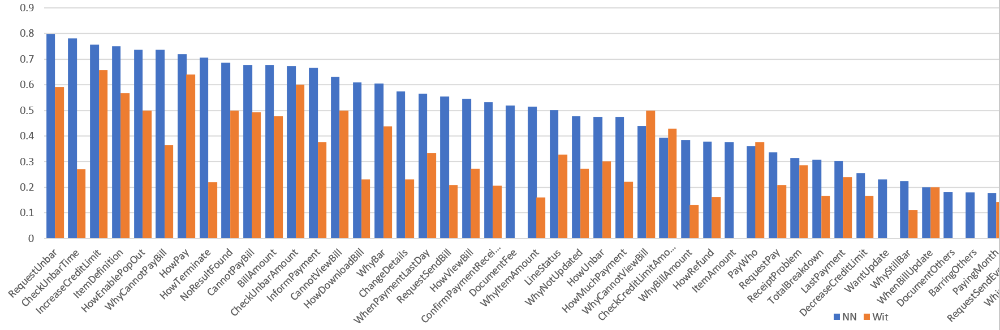

# AR-external-api
This project serves as a benchmark to Wooppy's Project AR deep learning model with external chatbot APIs such as:
* Wit.ai
* IBM Watson Bluemix (To be done)
* Luis.ai (To be done)

## Setup (For python)
It the best practice to have a own Virtual Environment for each project.

### Installing dependencies:
Run at root directory:
```
pip install -r requirements.txt
```

## Wit.ai
Run ``training.py`` to perform training. Different app is distinguished by an access token.

Run ``eval.py`` to perform evaluation. It will generate a ``prediction.csv`` file with predicted labels. 
#### PS : Evaluation speed is capped by 1 message per API call per second.

### Comparison of performance versus Wooppy's Engine 
